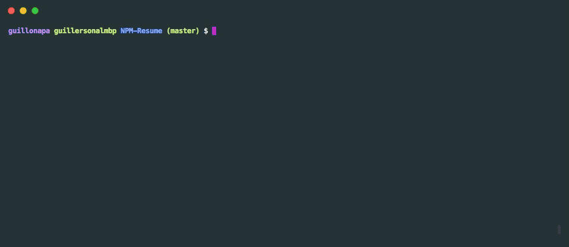

# NPM-Resume

[](https://img.shields.io/npm/dt/guillonapa-cv.svg?style=flat-square)   

This is a small project that I did so anyone can easily view my resume by simply installing an NPM package. Feel free to install and check it out from the command line.

## Get Started

To install globally in Mac, type:

```
sudo npm install -g guillonapa-cv
```

To install globally in Windows, type:

```
npm install -g guillonapa-cv
```

After you have installed the package globally, you can enter from anywhere in the command line `guillonapa-cv` to browse my resume.

## Preview

This project consists of a simple 'Read-Eval-Print' loop using `inquirer.js`. Some basic linting, testing using Mocha, and code transpiling is done using Grunt. Starting the package from the command line looks something like this:



## Code

Feel free to check out the code at [https://github.com/guillonapa/NPM-Resume](https://github.com/guillonapa/NPM-Resume) to create your own resume as an NPM package.

I took inspiration from [this](https://blog.usejournal.com/how-to-make-your-r%C3%A9sum%C3%A9-an-npm-package-fc5d6b6a3fbd) article, which I also encourage you to check out.
